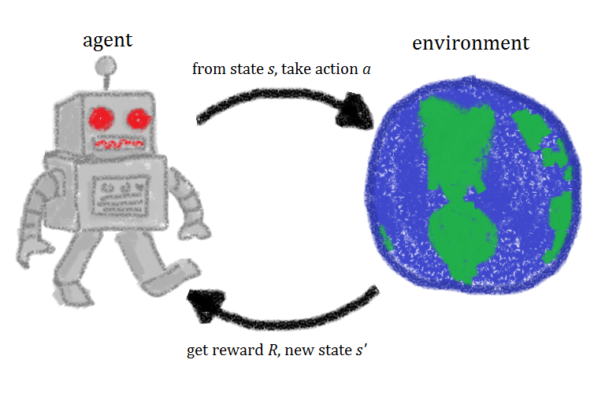

## About Repo:
This repository goes through the process of building an RL agent using `Deep-Q-Learning`

### About NOTEBOOK
Notebook contains the build code. It's presented in such a manner that should be easily understandable
### Let's look at the DQN architecture

As shown above DQN uses 2 networks 
 * Policy Network
 * Target Network

Checkout the notebook to know more

